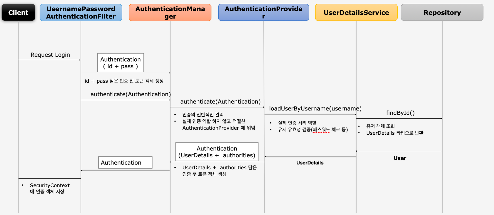
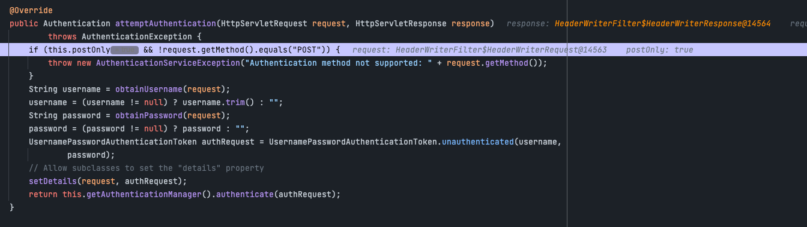
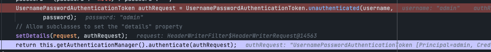
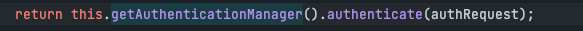
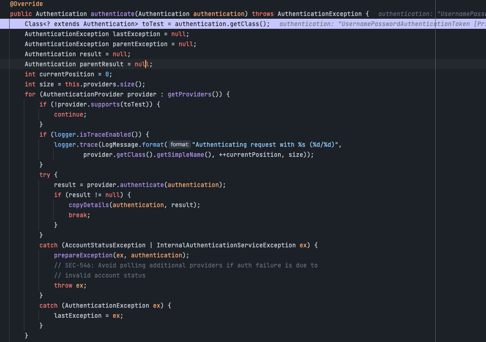
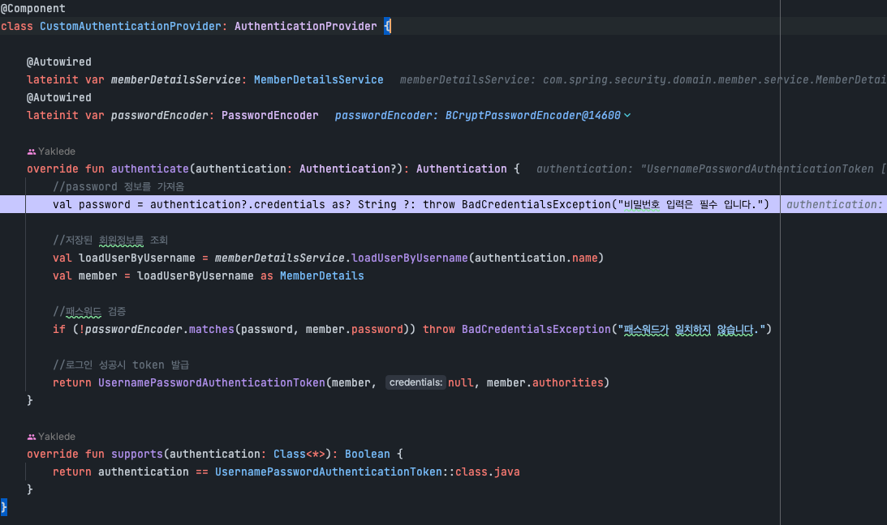
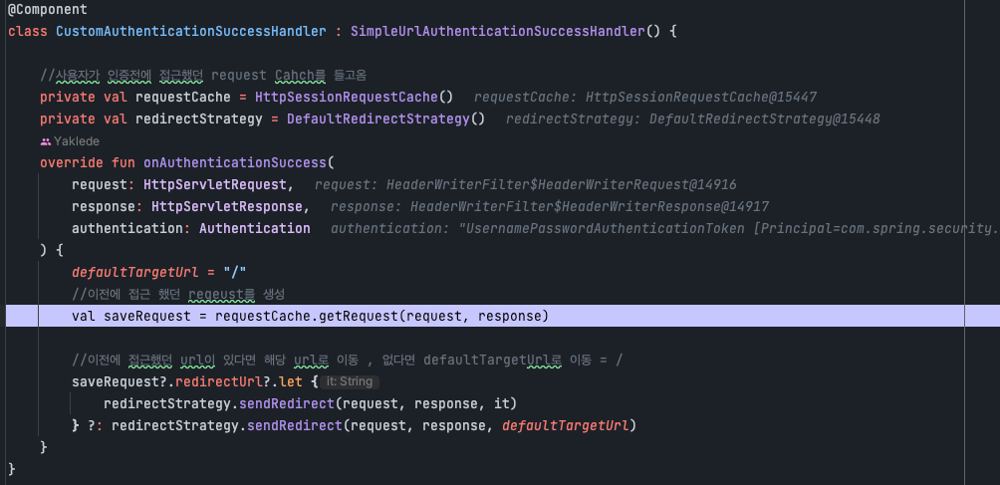

# Authentication Flow

1. 사용자가 로그인 요청을 보냄
2. UsernamePasswordAuthenticationFilter진입 후 해당 Request에 담긴 정보로 인증 전 AuthenticationToken 발급
   
   Authentication Token 발급
   
3. 발급된 인증 전 Token을 가지고 AuthenticationManager를 통해 적절한 Provider로 인증 위임
   
4. Manager에서 결정된 Provider에서 유저에 대한 유효성 검증
   
   supports메소드를 통해 적절한 provider인지 확인 후 해당 provider.authenticate(authentication)을 통해 해당 provider에 인증을 위임
5. Provider는 UserDetailsService를 이용하여 loadUserByUsername을 통해 해당 user에 존재여부 확인 후 password 검사
   해당 class에는 custom provider로 검증이 된다.
   
6. 인증 절차가 끝나면 해당 요청에 맞는 UserDetails 객체를 반환한다.
7. 반환 받은 UserDetails 정보와 authorities를 가지고 인증 된 AuthenticationToken을 생성
8. 생성된 token 정보를 SuccessHandler로 보내 인증 완료 처리
    

## 마치며
- 이번장에서는 security의 전반전인 Authenticaion Flow에 대해 살펴보았다.
- 다음장에서는 여기서 flow에 사용된 AuthenticationManager와 provider에 대해 살펴보겠다.
