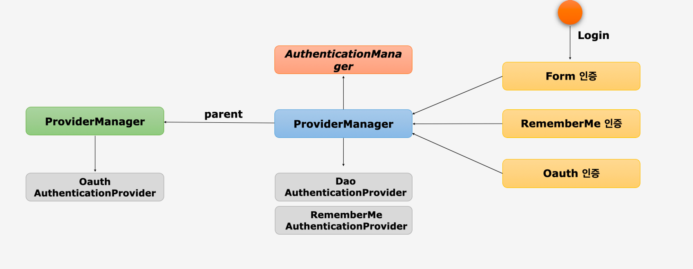
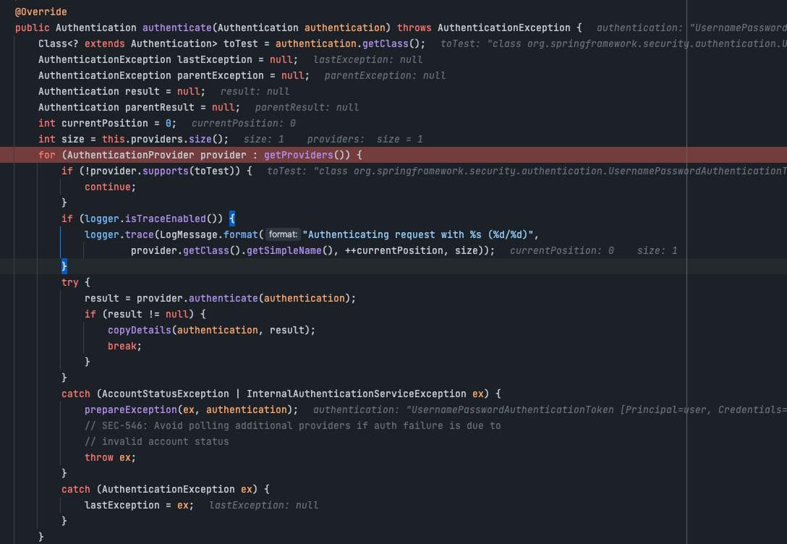
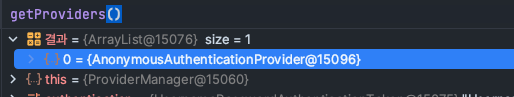
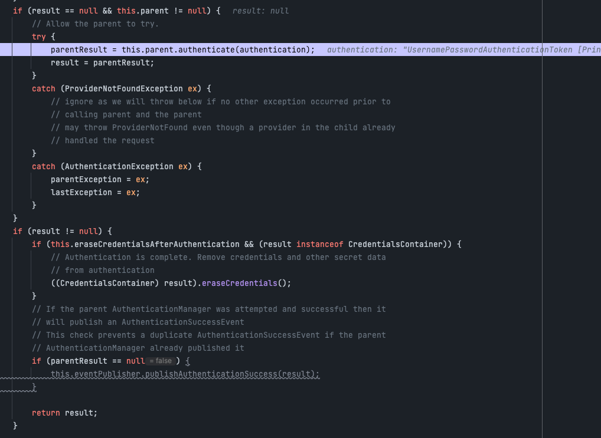
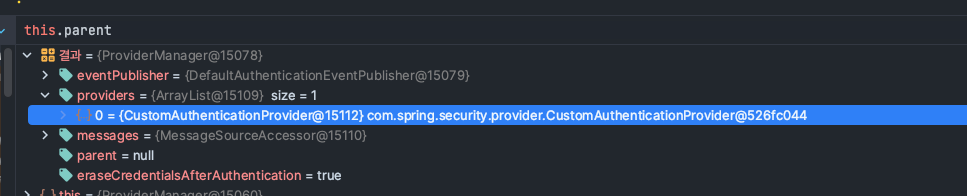
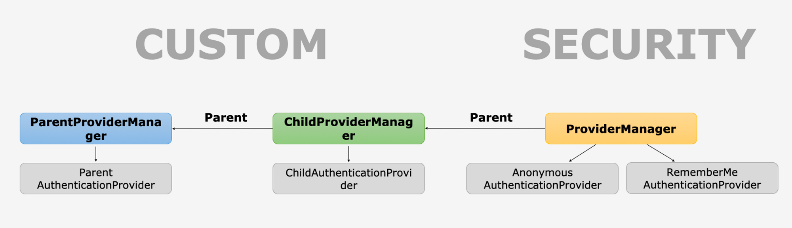

# AuthenticationManager

## 동작

1. 사용자가 로그인 요청을 보냈을 시 Form, RememberMe, Oauth2등 인증들이 ProviderManager로 이동한다.
2. ProviderManager는 받은 요청을 처리 할 수 있는 Provider 찾고 나서 해당 요청을 처리 할 수 있는 Provider로 인증을 위임한다.
    
   - 기본적으로 spring에서 제공해주는 provider에는 AnonymousAuthenticationProvider와 RememberMeAuthenticatoinProvider가 제공된다
   - 
3. 만일 요청을 처리할 수 있는 Provider를 찾지 못하면 parent 속성을 이용하여 사위 부모 타입의 Provider까지 살펴본 다음 요청을 처리한다.
   - spring 기본 provider로 처리할 수 없다면 parent의 AuthenticationProvider를 가져와서 검증한다.
   - 여기서는 CustomAuthenticationProvider가 해당된다.
   - 
   - 
   - child Provider에 인증 provider가 없다면 parent Provider 즉 custom한 Provider를 가져와서 검증을 한다.

4. 할당된 Provider에서 인증을 성공하면 Provider는 인증된 객체를 반환 해주는데 ProviderManager는 해당 객체를 받아서 요청을 보낸 Filter로 다시 돌려보내주는 역할까지도 담당한다.

## ParentProvider, ChildProvider, ProviderManager의 관계

- Linked 형태로 부모와 자식간의 관계를 형성 할 수 있다.
- 자식에서 적절한 AuthenticationProvider를 찾지 못 했을 경우에는 계속 부모로 탐색을 하여 찾는 과정을 반복하게 된다.
- AuthenticationManagerBuilder를 사용해서 스프링 시큐리티의 초기화 과정에서 설정한 기본 Parent관계를 변경을 해주어야 권한 필터에서 재 인증시 모든 AuthenticationProvider를 탐색할 수 있다.
- AuthenticationManagerBuilder를 이용하여 custom으로 인증에 대한 지원을 할 수 있다.

### 마치며
- authenticationManager는 Provider들을 가져와서 Provider에게 인증을 위임한다.
- 다음장에서는 AuthenticationProvider에 대해 알아보겠다.