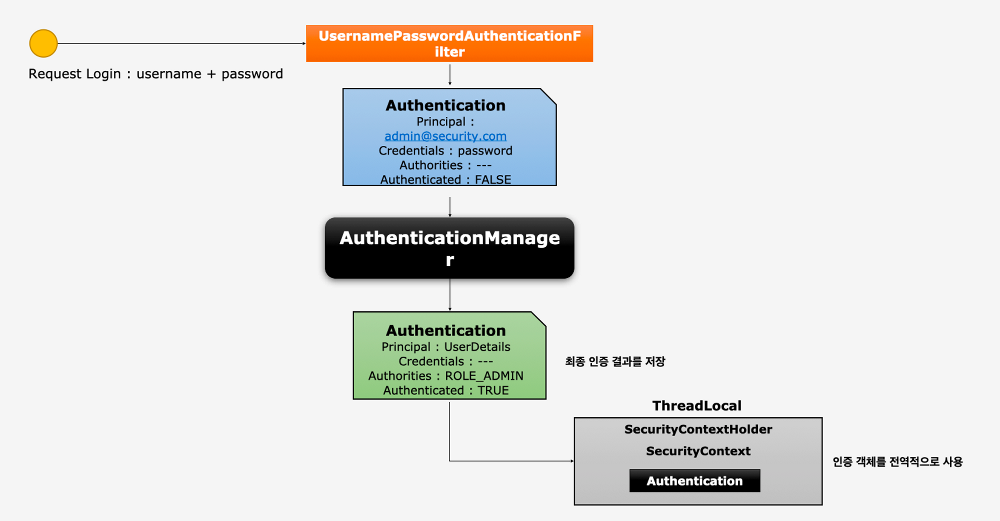
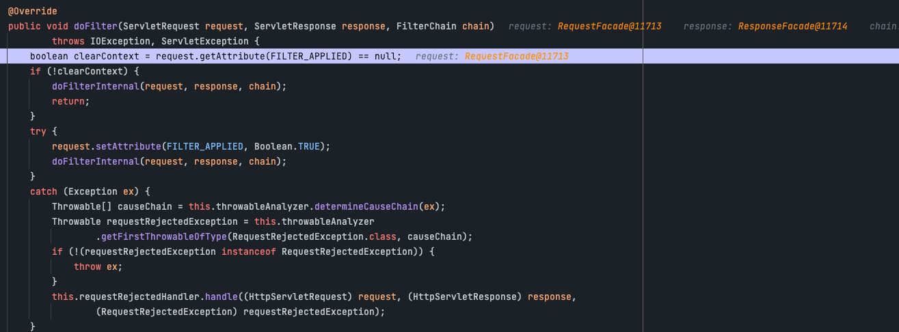
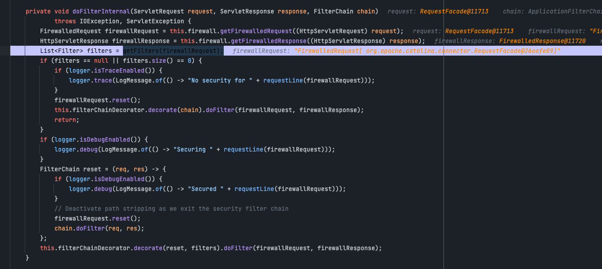
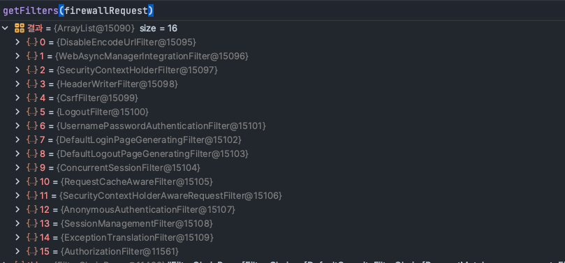
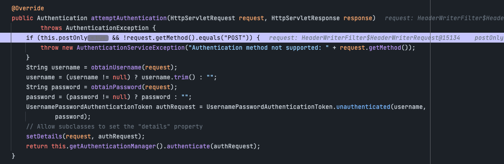

# Authentication

>Authenticationd이란? -> 당신이 누구인지 증명하는 것이다.
> - 사용자의 인증 정보를 제공하는 토큰 개념이다.
> - 인증 시 ID와 Password를 담고 검증을 위해 전달되어 사용된다.
> - 인증 후 최종 인증 결과(user객체, 권한정보)를 담고 Security Context에 저장되어 전역적으로 참조가 가능하다
> ```kotlin
> val authentication = SecurityContextHolder.getContext().authetication 

## 구성요소
1. principal: 사용자 ID 혹은 User객체를 저장한다
2. credentials: 사용자 비밀번호
3. authorities: 인증된 사용자의 권한 목록
4. details: 인증 부가 정보
5. Authentication: 인증여부

## Authentication interface
```java
/*
 * Copyright 2004, 2005, 2006 Acegi Technology Pty Limited
 *
 * Licensed under the Apache License, Version 2.0 (the "License");
 * you may not use this file except in compliance with the License.
 * You may obtain a copy of the License at
 *
 *      https://www.apache.org/licenses/LICENSE-2.0
 *
 * Unless required by applicable law or agreed to in writing, software
 * distributed under the License is distributed on an "AS IS" BASIS,
 * WITHOUT WARRANTIES OR CONDITIONS OF ANY KIND, either express or implied.
 * See the License for the specific language governing permissions and
 * limitations under the License.
 */

package org.springframework.security.core;

import java.io.Serializable;
import java.security.Principal;
import java.util.Collection;

import org.springframework.security.authentication.AuthenticationManager;
import org.springframework.security.core.context.SecurityContextHolder;

/**
 * Represents the token for an authentication request or for an authenticated principal
 * once the request has been processed by the
 * {@link AuthenticationManager#authenticate(Authentication)} method.
 * <p>
 * Once the request has been authenticated, the <tt>Authentication</tt> will usually be
 * stored in a thread-local <tt>SecurityContext</tt> managed by the
 * {@link SecurityContextHolder} by the authentication mechanism which is being used. An
 * explicit authentication can be achieved, without using one of Spring Security's
 * authentication mechanisms, by creating an <tt>Authentication</tt> instance and using
 * the code:
 *
 * <pre>
 * SecurityContext context = SecurityContextHolder.createEmptyContext();
 * context.setAuthentication(anAuthentication);
 * SecurityContextHolder.setContext(context);
 * </pre>
 *
 * Note that unless the <tt>Authentication</tt> has the <tt>authenticated</tt> property
 * set to <tt>true</tt>, it will still be authenticated by any security interceptor (for
 * method or web invocations) which encounters it.
 * <p>
 * In most cases, the framework transparently takes care of managing the security context
 * and authentication objects for you.
 *
 * @author Ben Alex
 */
public interface Authentication extends Principal, Serializable {

	/**
	 * Set by an <code>AuthenticationManager</code> to indicate the authorities that the
	 * principal has been granted. Note that classes should not rely on this value as
	 * being valid unless it has been set by a trusted <code>AuthenticationManager</code>.
	 * <p>
	 * Implementations should ensure that modifications to the returned collection array
	 * do not affect the state of the Authentication object, or use an unmodifiable
	 * instance.
	 * </p>
	 * @return the authorities granted to the principal, or an empty collection if the
	 * token has not been authenticated. Never null.
	 */
	Collection<? extends GrantedAuthority> getAuthorities();

	/**
	 * The credentials that prove the principal is correct. This is usually a password,
	 * but could be anything relevant to the <code>AuthenticationManager</code>. Callers
	 * are expected to populate the credentials.
	 * @return the credentials that prove the identity of the <code>Principal</code>
	 */
	Object getCredentials();

	/**
	 * Stores additional details about the authentication request. These might be an IP
	 * address, certificate serial number etc.
	 * @return additional details about the authentication request, or <code>null</code>
	 * if not used
	 */
	Object getDetails();

	/**
	 * The identity of the principal being authenticated. In the case of an authentication
	 * request with username and password, this would be the username. Callers are
	 * expected to populate the principal for an authentication request.
	 * <p>
	 * The <tt>AuthenticationManager</tt> implementation will often return an
	 * <tt>Authentication</tt> containing richer information as the principal for use by
	 * the application. Many of the authentication providers will create a
	 * {@code UserDetails} object as the principal.
	 * @return the <code>Principal</code> being authenticated or the authenticated
	 * principal after authentication.
	 */
	Object getPrincipal();

	/**
	 * Used to indicate to {@code AbstractSecurityInterceptor} whether it should present
	 * the authentication token to the <code>AuthenticationManager</code>. Typically an
	 * <code>AuthenticationManager</code> (or, more often, one of its
	 * <code>AuthenticationProvider</code>s) will return an immutable authentication token
	 * after successful authentication, in which case that token can safely return
	 * <code>true</code> to this method. Returning <code>true</code> will improve
	 * performance, as calling the <code>AuthenticationManager</code> for every request
	 * will no longer be necessary.
	 * <p>
	 * For security reasons, implementations of this interface should be very careful
	 * about returning <code>true</code> from this method unless they are either
	 * immutable, or have some way of ensuring the properties have not been changed since
	 * original creation.
	 * @return true if the token has been authenticated and the
	 * <code>AbstractSecurityInterceptor</code> does not need to present the token to the
	 * <code>AuthenticationManager</code> again for re-authentication.
	 */
	boolean isAuthenticated();

	/**
	 * See {@link #isAuthenticated()} for a full description.
	 * <p>
	 * Implementations should <b>always</b> allow this method to be called with a
	 * <code>false</code> parameter, as this is used by various classes to specify the
	 * authentication token should not be trusted. If an implementation wishes to reject
	 * an invocation with a <code>true</code> parameter (which would indicate the
	 * authentication token is trusted - a potential security risk) the implementation
	 * should throw an {@link IllegalArgumentException}.
	 * @param isAuthenticated <code>true</code> if the token should be trusted (which may
	 * result in an exception) or <code>false</code> if the token should not be trusted
	 * @throws IllegalArgumentException if an attempt to make the authentication token
	 * trusted (by passing <code>true</code> as the argument) is rejected due to the
	 * implementation being immutable or implementing its own alternative approach to
	 * {@link #isAuthenticated()}
	 */
	void setAuthenticated(boolean isAuthenticated) throws IllegalArgumentException;

}

```

## 구조


## 동작
1. 사용자가 로그인 요청을 form형식으로 전송
    - 
    - FilterChainProxy 클래스에 dofilter 메소드에 요청이 전달된다.
    - 해당 메소드에서 doFilterInternal를 호출한다
    - 
    - doFilterInternal에서 우리가 설정했던 filter들을 가져와서 순차적으로 검증에 들어간다.
    - 디버그를 찍어보면 우리가 설정했던 config설정에 따라 16개의 필터가 등록되어 있는걸 확인 할 수 있다
    - 
2. 해당 Request정보를 UsernamePasswordAuthenticationFilter 이동
    - 
3. 해당 필터에서 request를 이용하여 Authentication을 생성
    - setDetilas를 이용하여 authReqeust에 Authenticaton을 생성한다
4. AuthenticationManager를 통해 인증 위임
    - return에 보면 this.getAuthenticationManager().authenticate(authRequest) 부분을 호출하고 있는데 이 부분이 manger에게 인증을 위임하는 부분이다.
5. AuthenticationManager를 통해 인증에 성공하면 인증에 성공된 형태의 Authentication을 반환후 ThreadLocal에 SecurityContextHolder > SecurityContext > Authentication객체를 저장
6. 인증된 객체는 ThreadLcoal에서 관리하기 때문에 전역적으로 사용할 수 있다.


## 마치며
- 이번장에서 SecurityContextHolder와 SecurityContext라는 개념이 나왔는데 이 부분으 다음장에서 설명하겠다.
- 이번장에서는 Authenctaion이 무엇인지 파악하는것을 중점으로 생각해야한다.
- 현재 설명이 안된 filter나 manger같은 개념들은 뒷장에서 설명이 나온다. 이 장에서는 간단하게 이것이 무엇을 하는지만 파악을 하고 있으면 된다.