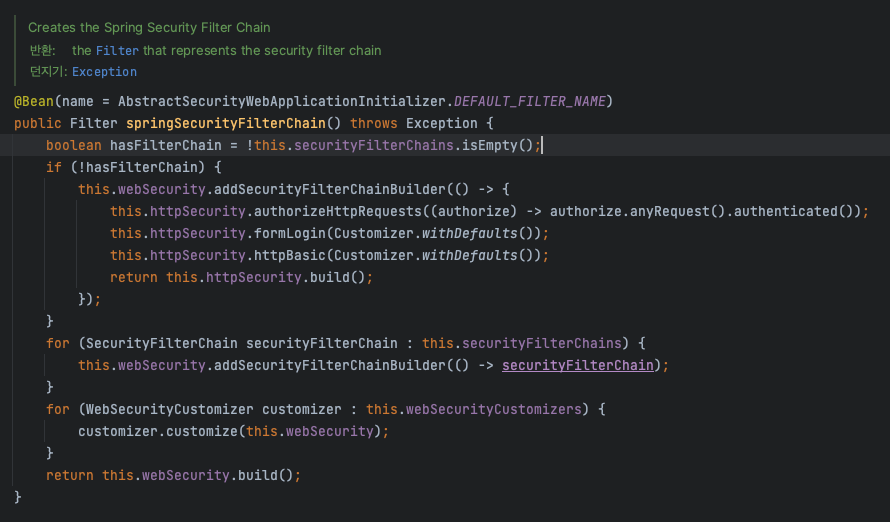

# DelegatingFilterProxy

## 무엇인가?
> Delegating filter proxy란 서블렛 필터에서 스프링 빈을 만들어 해당 빈에게 filter 요청을 전달한다
## 왜 필요한가?
> 서블렛 필터에서는 스프링 빈을 주입받아서 사용 할 수 없어서 스프링이 고안한 방법이다


## 구조


## 역할
> DelegatingFilterProxy는 특정한 이름을 가진 스프링 빈을 찾아 그빈에게 요청을 위임한다.
>> 특정한 이름 : springSecurityFilterProxy
> 
> spring boot 기준 SecurityFilterAutoConfiguration Class를 통해 DelegatingFilterProxy를 만든다

## 특징
DelegatingFilterProxy는 단순히 요청을 위임할 뿐 실제 보안처리를 담당하지 않는다.

## FilterChainProxy
> 
> springSecurityFilterChain을 빈으로 등록한다.

## 역할
1. FilterChainProxy는 DelegatingFilterProxy가 생성하는 필터 빈이다.
2. DelegatingFilterProxy으로부터 요청을 위임받고 실제 보안처리를 담당하는 부분이다.
3. spring security 초기화 시 생성되는 필터들을 관리하고 제어한다
    - spring security가 기본적으로 생성하는 필터
    - 설정 클래스에서 api추가 시 생성되는 필터
4. 사용자의 요청을 필터 순서대로 호출하여 전달한다.
5. 사용자정의 필터를 생성해서 기존의 필터 전,후로 추가 가능하다
    - 따라서 사용자필터의 순서를 잘 지정해야한다.
6.마지막 필터까지 인증 및 인가 예외가 발생하지 않으면 보안을 통과하게 된다


## 구조


## 마치며
이번 글에서는 delegating filter proxy와 filter chain proxy에 대해 알아보았다

### delegating filter proxy
delegating filter proxy는 간단하게 생각하면 servlet filter와 spring을 이어주는 징검다리 역할이라고 말 할 수 있다
들어오는 요청을 security filter chain으로 전달할 뿐 실제 보안 처리를 담당하지 않는다

### filter chain proxy
filter chain proxy를 간단하게 설명하면 spring security가 기본적으로 생성되는 + 설정 클래스에서 API 추가 시 생성되는 필터의 모음집이다.
```kotlin
    @Bean
    fun configurer(http: HttpSecurity): SecurityFilterChain {
        //권한 설정
        http
            .authorizeHttpRequests()
            .requestMatchers("/user").hasRole("USER")
            .requestMatchers("/sys").hasRole("SYS")
            .requestMatchers("/admin").hasRole("ADMIN")

        //인가 정책
        http
            .authorizeHttpRequests()
            .requestMatchers("/join", "/exception", "/denied")
            .permitAll()

        http
            .authorizeHttpRequests()
            .anyRequest().authenticated()

        //인증 정책 default form 인증
        http
            .formLogin()
            .defaultSuccessUrl("/")
            .failureForwardUrl("/login")
            .usernameParameter("username")
            .passwordParameter("password")
            .loginProcessingUrl("/login_proc")
            .successHandler(DefaultLoginSuccessHandler())
            .successHandler(CustomAuthenticationSuccessHandler())
            .failureHandler(DefaultLoginFailHandler())
            .failureHandler(CustomAuthenticationFailureHandler())
            .permitAll() //인증이 되어 있지 않아도 접근이 가능함
            .and()
            .exceptionHandling()
            .accessDeniedHandler(CustomAccessDeniedHandler())


        //logout
        http
            .logout() // logout
            //.logoutUrl("/logout") //logout request url
            .logoutSuccessUrl("/login") // logout Success Redirect Url
            .addLogoutHandler(DefaultLogoutHandler()) // 로그아웃 요청시 동작하는 handler
            .logoutSuccessHandler(DefaultLogoutSuccessHandler()) //로그아웃 성공시 동작하는 handler
            .deleteCookies("remember-me") //해당 이름의 쿠키 삭제

        //session Management Filter
        http
            .sessionManagement()
            .maximumSessions(1) // 최대 세션 1개
            .maxSessionsPreventsLogin(true) // 1개 이후에는 더이상 세션이 생기지 않도록 즉 2번째 요청부터 로그인을 막음 false일 땐 기존 사용자 로그아웃

        return http.orBuild
    }
```
우리가 설정한 config class에서 선언한 security filter chain이 filter chain proxy로 만들어지게 된다.

다음 글에서는 필터가 초기화 되는 과정과 다중 설정 클래스에 대해서 알아보겠다.
