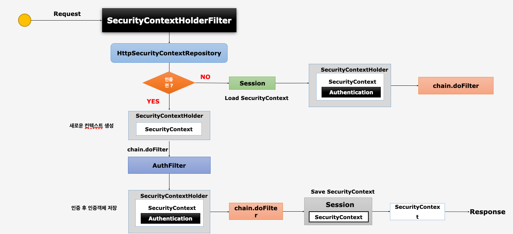
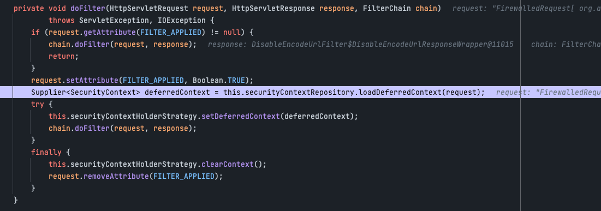
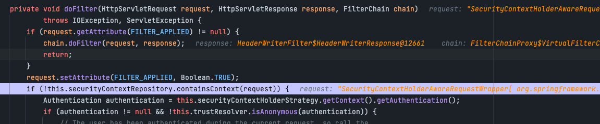
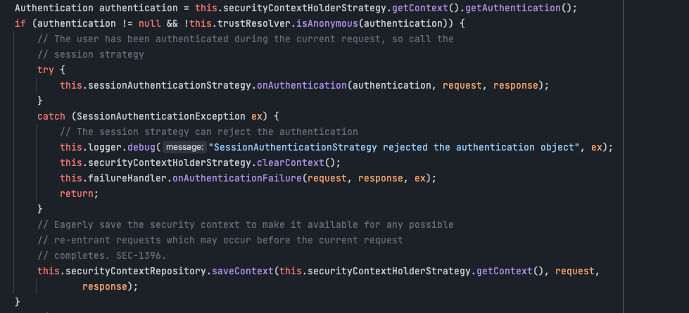
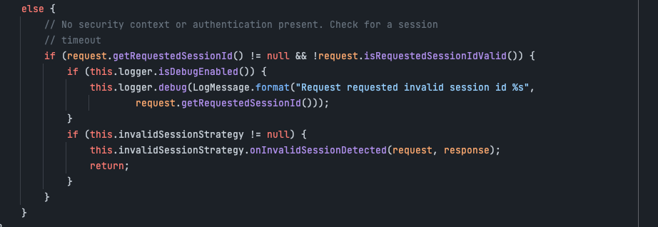
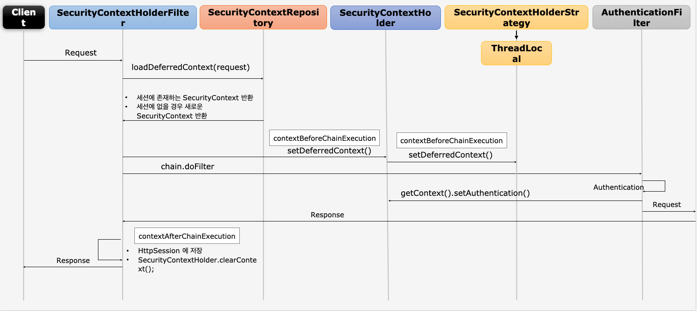
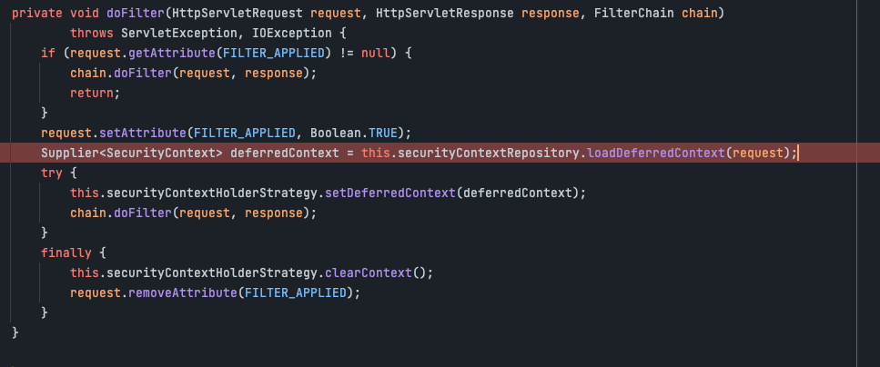
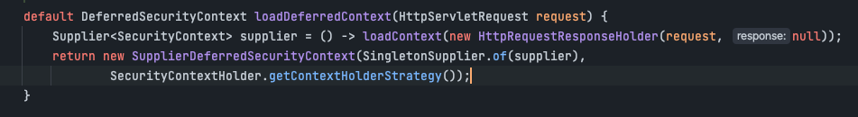
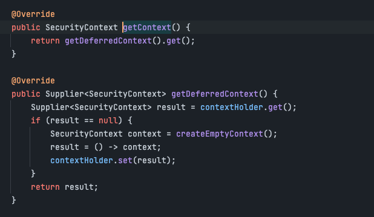

# SecurityContextPersistenceFilter, SecurityContextHolderFilter

> SecurityContextPersistenceFilter -> version 5.7 이전
> SecurityContextHolderFilter -> version 5.7 이후

본 글은 SecurityContextHolderFilter 기준으로 작성되었다.

> ## 무엇인가?
> SecurityContext의 객체의 생성, 저장, 조회를 담당하는 filter이다.

## SecurityContext 객체의 생성, 저장, 조회
* 익명사용자
  * 새로운 SecurityContext 객체를 생성 후 SecurityContextHolder에 저장한다.
  * AnonymousAuthenticationFilter에서 AnonymousAuthenticationToken 객체를 SecurityContext에 저장한다.
* 인증 시
  * 새로운 SecurityContext 객체를 생성 후 SecurityContextHolder에 저장한다.
  * (FormLogin 기준) UsernamePasswordAuthenticationFilter에서 인증 성공 후 SecurityContext에 UsernamePasswordAuthenticationToken 객체를 SecurityContext에 저장한다.
  * 인증이 최정적으로 완료되면 Session에 SecurityContext를 저장한다.
* 인증 후
  * Session에서 SecurityContext를 꺼내어 SecurityContextHolder에 저장한다.
  * SecurityContext안에 Authenticataion객체가 존재할 시 계속 인증정보를 유지한다.
* 최초 응답시 공통 동작
  * SecurityContextHolder객체의 clearContext() 메소드를 통해 SecurityContextHolder를 초기화한다.

## 동작

1. Request요청이 들어오고 SecurityContextPersistenceFilter에 진입한다.
2. HttpSecurityContextRepository를 통해 인증이 되었는지 검증한다.
   * 
   * SessionManagementFilter에서 인증되었는지 확인
   * 
3. 인증이 되어 있지 않다면 새로운 context를 생성하고 인증 필터를 거친 후 인증에 성공하면 인증 객체를 저장하고 다음필터를 진행한다. 필터를 모두 마친 후엔 Session정보에 SecurityContext를 저장한다.
   * 
4. 인증이 되어있다면 해당 Session정보에서 SecurityContext를 꺼내어 인증 정보를 가져온 후 다음 필터를 진행한다.
   * 

    
## 동작 FLOW

1. 클라이언트 요청 후 세션에 존재하는 SecurityContext를 반환, 없다면 새로운 Securitycontext를 생성 후 반환
   * 
   * 
   * 
2. 생성된 SecurityContext로 인증 프로세스 진행 후 인증에 성공하면 해당 SecurityContext에 인증 객체를 담아서 반환
3. 해당 HttpSession에 SecuriryContext를 저장후 SecurityContextHolder를 초기화

## 마치며
- 이번장에서는 SecurityContext와, SecurityContextHolder가 어떻게 생성되고 조회되는지 알아보았다.
- 다음장에서는 Authentication flow, spring security의 인증에 대한 전반적인 플로우를 알아보자.