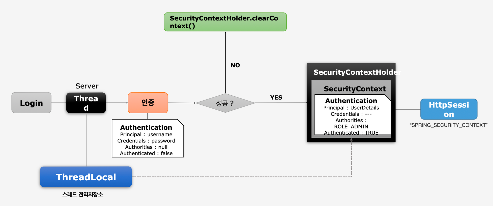
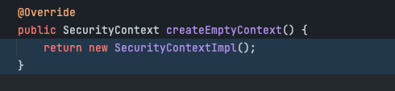
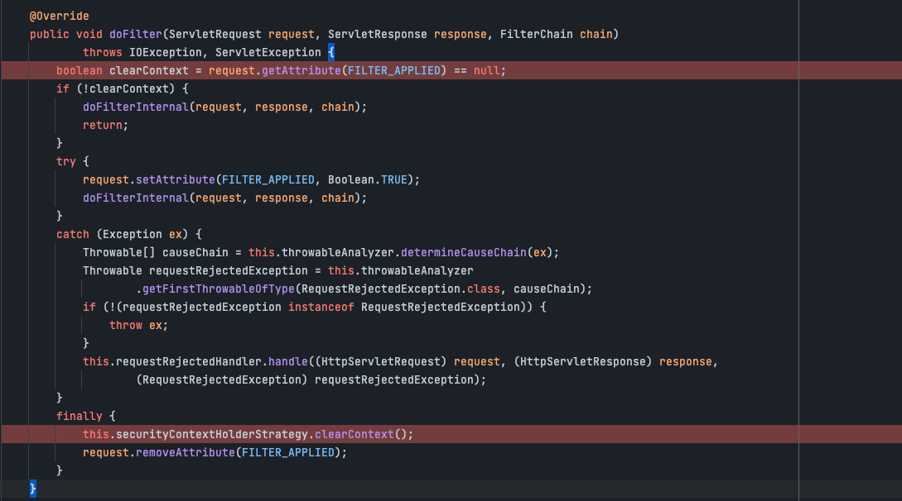

# SecurityContextHolder, SecurityContext

## SecurityContextHolder

- Authentication 객체가 저장되는 보관소로 필요 시 언제든지 Authentication 객체를 꺼내어 쓸 수 있도록 제공되는 클래스이다
- ThreadLocal에 저장되어 아무 곳에서나 참조가 가능할 수 있다.
- 인증이 완료되면 HttpSession에 저장되어 어플리케이션 전반에 걸쳐 참조가 가능하다

## SecurityContextHolder
* SecurityContext의 객체 저장 방식은 총 3가지르 지원한다.
  * MODE_THREADLOCAL: 스레드당 SecurityContext 객체를 할당한다 (default)
  * MODE_INHERITABLETHREADLOCAL: 메인 스레드와 자식 스레드에 관하여 동일한 SecurityContext를 유지한다
  * MODE_GLOBAL: 응용 프로그램에서 단 하나의 SecurityContext를 저장한다.

## ScurityContextHolder Class
```java
/*
 * Copyright 2004, 2005, 2006 Acegi Technology Pty Limited
 *
 * Licensed under the Apache License, Version 2.0 (the "License");
 * you may not use this file except in compliance with the License.
 * You may obtain a copy of the License at
 *
 *      https://www.apache.org/licenses/LICENSE-2.0
 *
 * Unless required by applicable law or agreed to in writing, software
 * distributed under the License is distributed on an "AS IS" BASIS,
 * WITHOUT WARRANTIES OR CONDITIONS OF ANY KIND, either express or implied.
 * See the License for the specific language governing permissions and
 * limitations under the License.
 */

package org.springframework.security.core.context;

import java.lang.reflect.Constructor;
import java.util.function.Supplier;

import org.springframework.util.Assert;
import org.springframework.util.ReflectionUtils;
import org.springframework.util.StringUtils;

/**
 * Associates a given {@link SecurityContext} with the current execution thread.
 * <p>
 * This class provides a series of static methods that delegate to an instance of
 * {@link org.springframework.security.core.context.SecurityContextHolderStrategy}. The
 * purpose of the class is to provide a convenient way to specify the strategy that should
 * be used for a given JVM. This is a JVM-wide setting, since everything in this class is
 * <code>static</code> to facilitate ease of use in calling code.
 * <p>
 * To specify which strategy should be used, you must provide a mode setting. A mode
 * setting is one of the three valid <code>MODE_</code> settings defined as
 * <code>static final</code> fields, or a fully qualified classname to a concrete
 * implementation of
 * {@link org.springframework.security.core.context.SecurityContextHolderStrategy} that
 * provides a public no-argument constructor.
 * <p>
 * There are two ways to specify the desired strategy mode <code>String</code>. The first
 * is to specify it via the system property keyed on {@link #SYSTEM_PROPERTY}. The second
 * is to call {@link #setStrategyName(String)} before using the class. If neither approach
 * is used, the class will default to using {@link #MODE_THREADLOCAL}, which is backwards
 * compatible, has fewer JVM incompatibilities and is appropriate on servers (whereas
 * {@link #MODE_GLOBAL} is definitely inappropriate for server use).
 *
 * @author Ben Alex
 * @author Rob Winch
 *
 */
public class SecurityContextHolder {

	public static final String MODE_THREADLOCAL = "MODE_THREADLOCAL";

	public static final String MODE_INHERITABLETHREADLOCAL = "MODE_INHERITABLETHREADLOCAL";

	public static final String MODE_GLOBAL = "MODE_GLOBAL";

	private static final String MODE_PRE_INITIALIZED = "MODE_PRE_INITIALIZED";

	public static final String SYSTEM_PROPERTY = "spring.security.strategy";

	private static String strategyName = System.getProperty(SYSTEM_PROPERTY);

	private static SecurityContextHolderStrategy strategy;

	private static int initializeCount = 0;

	static {
		initialize();
	}

	private static void initialize() {
		initializeStrategy();
		initializeCount++;
	}

	private static void initializeStrategy() {
		if (MODE_PRE_INITIALIZED.equals(strategyName)) {
			Assert.state(strategy != null, "When using " + MODE_PRE_INITIALIZED
					+ ", setContextHolderStrategy must be called with the fully constructed strategy");
			return;
		}
		if (!StringUtils.hasText(strategyName)) {
			// Set default
			strategyName = MODE_THREADLOCAL;
		}
		if (strategyName.equals(MODE_THREADLOCAL)) {
			strategy = new ThreadLocalSecurityContextHolderStrategy();
			return;
		}
		if (strategyName.equals(MODE_INHERITABLETHREADLOCAL)) {
			strategy = new InheritableThreadLocalSecurityContextHolderStrategy();
			return;
		}
		if (strategyName.equals(MODE_GLOBAL)) {
			strategy = new GlobalSecurityContextHolderStrategy();
			return;
		}
		// Try to load a custom strategy
		try {
			Class<?> clazz = Class.forName(strategyName);
			Constructor<?> customStrategy = clazz.getConstructor();
			strategy = (SecurityContextHolderStrategy) customStrategy.newInstance();
		}
		catch (Exception ex) {
			ReflectionUtils.handleReflectionException(ex);
		}
	}

	/**
	 * Explicitly clears the context value from the current thread.
	 */
	public static void clearContext() {
		strategy.clearContext();
	}

	/**
	 * Obtain the current <code>SecurityContext</code>.
	 * @return the security context (never <code>null</code>)
	 */
	public static SecurityContext getContext() {
		return strategy.getContext();
	}

	/**
	 * Obtains a {@link Supplier} that returns the current context.
	 * @return a {@link Supplier} that returns the current context (never
	 * <code>null</code> - create a default implementation if necessary)
	 * @since 5.8
	 */
	public static Supplier<SecurityContext> getDeferredContext() {
		return strategy.getDeferredContext();
	}

	/**
	 * Primarily for troubleshooting purposes, this method shows how many times the class
	 * has re-initialized its <code>SecurityContextHolderStrategy</code>.
	 * @return the count (should be one unless you've called
	 * {@link #setStrategyName(String)} or
	 * {@link #setContextHolderStrategy(SecurityContextHolderStrategy)} to switch to an
	 * alternate strategy).
	 */
	public static int getInitializeCount() {
		return initializeCount;
	}

	/**
	 * Associates a new <code>SecurityContext</code> with the current thread of execution.
	 * @param context the new <code>SecurityContext</code> (may not be <code>null</code>)
	 */
	public static void setContext(SecurityContext context) {
		strategy.setContext(context);
	}

	/**
	 * Sets a {@link Supplier} that will return the current context. Implementations can
	 * override the default to avoid invoking {@link Supplier#get()}.
	 * @param deferredContext a {@link Supplier} that returns the {@link SecurityContext}
	 * @since 5.8
	 */
	public static void setDeferredContext(Supplier<SecurityContext> deferredContext) {
		strategy.setDeferredContext(deferredContext);
	}

	/**
	 * Changes the preferred strategy. Do <em>NOT</em> call this method more than once for
	 * a given JVM, as it will re-initialize the strategy and adversely affect any
	 * existing threads using the old strategy.
	 * @param strategyName the fully qualified class name of the strategy that should be
	 * used.
	 */
	public static void setStrategyName(String strategyName) {
		SecurityContextHolder.strategyName = strategyName;
		initialize();
	}

	/**
	 * Use this {@link SecurityContextHolderStrategy}.
	 *
	 * Call either {@link #setStrategyName(String)} or this method, but not both.
	 *
	 * This method is not thread safe. Changing the strategy while requests are in-flight
	 * may cause race conditions.
	 *
	 * {@link SecurityContextHolder} maintains a static reference to the provided
	 * {@link SecurityContextHolderStrategy}. This means that the strategy and its members
	 * will not be garbage collected until you remove your strategy.
	 *
	 * To ensure garbage collection, remember the original strategy like so:
	 *
	 * <pre>
	 *     SecurityContextHolderStrategy original = SecurityContextHolder.getContextHolderStrategy();
	 *     SecurityContextHolder.setContextHolderStrategy(myStrategy);
	 * </pre>
	 *
	 * And then when you are ready for {@code myStrategy} to be garbage collected you can
	 * do:
	 *
	 * <pre>
	 *     SecurityContextHolder.setContextHolderStrategy(original);
	 * </pre>
	 * @param strategy the {@link SecurityContextHolderStrategy} to use
	 * @since 5.6
	 */
	public static void setContextHolderStrategy(SecurityContextHolderStrategy strategy) {
		Assert.notNull(strategy, "securityContextHolderStrategy cannot be null");
		SecurityContextHolder.strategyName = MODE_PRE_INITIALIZED;
		SecurityContextHolder.strategy = strategy;
		initialize();
	}

	/**
	 * Allows retrieval of the context strategy. See SEC-1188.
	 * @return the configured strategy for storing the security context.
	 */
	public static SecurityContextHolderStrategy getContextHolderStrategy() {
		return strategy;
	}

	/**
	 * Delegates the creation of a new, empty context to the configured strategy.
	 */
	public static SecurityContext createEmptyContext() {
		return strategy.createEmptyContext();
	}

	@Override
	public String toString() {
		return "SecurityContextHolder[strategy='" + strategy.getClass().getSimpleName() + "'; initializeCount="
				+ initializeCount + "]";
	}

}
```

## 구조


1. Client login 요청
2. 해당 Thread에서 ThreadLocal에 SecurityContext객체를 생성 후 할당
   -  
   - SecurityContextHolderStrategy interface를 구현한 각각의 전략 객체들 안에서 생성된다.
3. 인증 flow 진행
   - 이 부분은 Authentication Flow 장에서 다루도록 하겠다.
4. 인증에 실패하면 저장되어 있던 SecurityContext를 초기화
5. 인증에 성공 시 SecurityContextHolder > SecurityContext에 인증 객체인 Authentication 객체를 저장 후 HttpSession에 SecurityContext를 저장한다
6. 저장 완료 후 SecurityContextHolder를 초기화
    - 
    - FilterChainProxy의 마지막 finally 부분에서 초기화 과정이 일어난다.


## 마치며

- 이번장에서는 SecurityContextHolder와 SecurityContext에 대해 알아보았다.
- 다음 장에서는 SecurityContext 객체의 생성, 저장, 조회의 과정들을 담고 있는 SecurityContextPersistenceFilter에 대해 알아보겠다.


