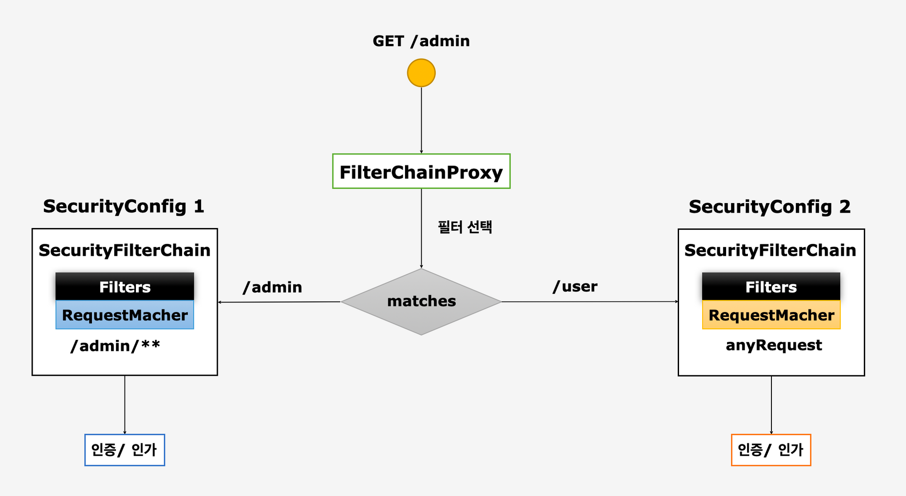

# 필터 초기화와 다중 설정 클래스
> 이번장에서는 다중 설정 클래스가 있을 때 spring security의 동작방식에 대해 알아보겠다.
> - spring security는 여러개의 다중 설정 클래스를 설정 할 수 있도록 만들어져있다.

## 구조


## 역할

1. 설정 클래스 별로 보안 기능이 작동한다.
2. 설정 클래스 별로 RequestMatchers 설정 가능하다
3. 설정 클래스 별로 필터가 생성된다.
4. FilterChainProxy가 각 필터들을 가지고 있다.
5. 요청에 따라 RequestMatchers와 매칭되는 필터가 작동되도록 한다.

## 동작구조


 - SecurityConfig1과 SecurityConfig2에서 맞는 requestMatchers로 매핑되어 해당 config에서 인증/인가 처리가 된다.
 - 만약 SecurityConfig1과 SecurityConfig2처럼 동시에 여러 설정 클래스를 선언할경우 조건이 상세한 것부터 동작되도록 순서를 잘 지정해야한다.

아래와 같이 SecurityConfig와  SecurityConfig2를 설정하였다

```kotlin
@Configuration
@EnableWebSecurity
@Order(1)
class SecurityConfig {
    @Bean
    fun authManager(http: HttpSecurity): AuthenticationManager {
        val provider = http.getSharedObject(AuthenticationManagerBuilder::class.java)
        provider.authenticationProvider(CustomAuthenticationProvider())
        return provider.orBuild
    }

    @Bean
    fun configurer(http: HttpSecurity): SecurityFilterChain {
        //권한 설정
        http
            .authorizeHttpRequests()
            .requestMatchers("/user").hasRole("USER")
            .requestMatchers("/sys").hasRole("SYS")
            .requestMatchers("/admin").hasRole("ADMIN")

        //인가 정책
        http
            .authorizeHttpRequests()
            .requestMatchers("/join", "/exception", "/denied")
            .permitAll()

        http
            .authorizeHttpRequests()
            .anyRequest().authenticated()

        //인증 정책 default form 인증
        http
            .formLogin()
            .defaultSuccessUrl("/")
            .failureForwardUrl("/login")
            .usernameParameter("username")
            .passwordParameter("password")
            .loginProcessingUrl("/login_proc")
            .successHandler(DefaultLoginSuccessHandler())
            .successHandler(CustomAuthenticationSuccessHandler())
            .failureHandler(DefaultLoginFailHandler())
            .failureHandler(CustomAuthenticationFailureHandler())
            .permitAll() //인증이 되어 있지 않아도 접근이 가능함
            .and()
            .exceptionHandling()
            .accessDeniedHandler(CustomAccessDeniedHandler())


        //logout
        http
            .logout() // logout
            //.logoutUrl("/logout") //logout request url
            .logoutSuccessUrl("/login") // logout Success Redirect Url
            .addLogoutHandler(DefaultLogoutHandler()) // 로그아웃 요청시 동작하는 handler
            .logoutSuccessHandler(DefaultLogoutSuccessHandler()) //로그아웃 성공시 동작하는 handler
            .deleteCookies("remember-me") //해당 이름의 쿠키 삭제

        //session Management Filter
        http
            .sessionManagement()
            .maximumSessions(1) // 최대 세션 1개
            .maxSessionsPreventsLogin(true) // 1개 이후에는 더이상 세션이 생기지 않도록 즉 2번째 요청부터 로그인을 막음 false일 땐 기존 사용자 로그아웃

        return http.orBuild
    }

    @Bean
    fun passwordEncoder(): PasswordEncoder {
        return BCryptPasswordEncoder(16)
    }
}
```

```kotlin
@Configuration
@EnableWebSecurity
@Order(2)
class SecurityConfig2 {
    
    @Bean
    fun configurer(http: HttpSecurity): SecurityFilterChain {
        http.authorizeHttpRequests()
            .anyRequest()
            .permitAll()
        return http.orBuild
    }
}
```

해당 설정들 상단에보면 @Order라는 애노테이션이 붙어 있다. 해당 애노테이션은 스프링에서 빈의 로드 순서를 지정할 수 있도록 만들어둔 애노테이션이다.

현재 SecurityConfig가 1번으로 SecurityConfig2가 2번으로 등록되어 있다.


디버그 확인시 SecurityFilterChains에 size가 2인걸 확인 할 수 있다.


SecuriryFilterChains 배열에 설정한 2개의 filterChain이 담겨있는걸 볼 수 있다.


## Spring Security 설정 초기화 과정


1. Servlet Container가 시작될 때 DelegatingFilterProxy를 생성

2. WebSecurityConfiguration에서 securityFilterChain을 생성

3. WebSecurity에서 config에 설정한 api 기준으로 filter생성

4. 등록된 filterChainProxy로 여러개의 필터들이 순차적으로 호출 되면서 요청에 대한 보안 처리 수행
    - filterChainProxy가 각 필터들을 가지고 있다.
    - 요청에 따라 RequestMatchers와 매칭되는 필터가 작동되도록 한다.


## 마치며 

이번장에서는 Spring security의 다중 설정 클래스와 Spring Security가 어떻게 초기화 되고 요청을 처리하는지 알아보았다.

다음장에서는 spring security의 인증인 authentication에 대해 파헤쳐보겠다.


